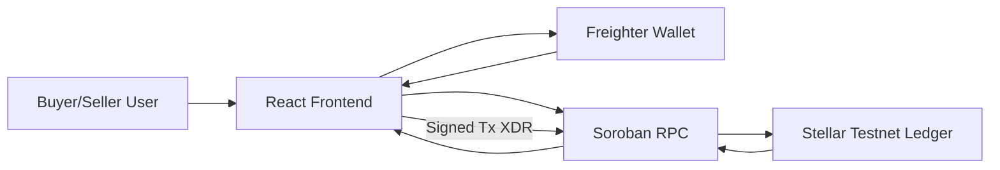

# TrustPay - Decentralized Escrow Payment System on Stellar

TrustPay is a production-style MVP for escrow payments on Stellar Testnet using Soroban and Freighter. Buyers lock funds in a contract, then release payment to sellers only after confirmation.

## Features
- Freighter wallet connect and transaction signing (Testnet only)
- Soroban escrow contract with secure status transitions
- Create escrow with seller address + amount
- Buyer-only release and buyer-triggered refund
- Dashboard that loads escrow records from on-chain contract state
- Real transaction feedback with hash + explorer links
- Onboarding support: copy address, Friendbot guidance, wallet install flow
- Session transaction history and loading states

## Tech Stack
- Frontend: React + Vite + Tailwind CSS
- Wallet: Freighter API
- Blockchain: Stellar Soroban smart contract (Rust)
- Network: Stellar Testnet RPC + Horizon
- Frontend deployment target: Vercel

## Architecture Diagram


See full architecture details in `ARCHITECTURE.md`.

## Repository Structure
- `frontend/` - Vite React app
- `contract/trustpay-escrow/` - Soroban Rust smart contract
- `ARCHITECTURE.md` - interaction and data flow documentation

## Local Setup
### 1) Prerequisites
- Node.js 20+
- Rust + Cargo
- Soroban CLI installed ([official docs](https://developers.stellar.org/docs/tools/soroban-cli))
- Freighter browser wallet

### 2) Install Frontend
```bash
cd frontend
npm install
cp .env.example .env
```

Set:
- `VITE_SOROBAN_CONTRACT_ID` = deployed escrow contract ID
- `VITE_SOROBAN_TOKEN_CONTRACT_ID` = token contract address used for escrow funds

### 3) Build Contract
```bash
cd contract/trustpay-escrow
cargo build --target wasm32-unknown-unknown --release
```

## Soroban Deployment (Testnet)
From `contract/trustpay-escrow`:

```bash
soroban config network add --global testnet \
  --rpc-url https://soroban-testnet.stellar.org \
  --network-passphrase "Test SDF Network ; September 2015"

soroban config identity generate buyer
soroban config identity fund buyer --network testnet

soroban contract deploy \
  --wasm target/wasm32-unknown-unknown/release/trustpay_escrow.wasm \
  --source buyer \
  --network testnet
```

Then initialize once from frontend (`Initialize Contract` button) or CLI:
```bash
soroban contract invoke \
  --id <ESCROW_CONTRACT_ID> \
  --source buyer \
  --network testnet \
  -- initialize \
  --token <TOKEN_CONTRACT_ID>
```

## Run Frontend
```bash
cd frontend
npm run dev
```

Or from project root:
```bash
npm install
npm run dev
```

## Freighter Usage Guide
1. Install Freighter extension.
2. Create/import account and switch to **Testnet**.
3. Fund wallet with Friendbot.
4. Open TrustPay and click **Connect Freighter**.
5. Approve contract interactions in Freighter popup for:
   - `create_escrow`
   - `release_payment`
   - `refund_payment`

## Example Test Flow (Buyer -> Seller -> Release)
1. Buyer connects wallet and verifies address shown.
2. Buyer opens `Create Escrow`, enters seller public key and amount.
3. Buyer signs `create_escrow` transaction in Freighter.
4. Dashboard refreshes and shows escrow in `Pending`.
5. After fulfillment, buyer clicks `Release Payment`.
6. Buyer signs release transaction; status updates to `Released`.
7. Open explorer link to verify final on-chain transaction.

## Error Handling Coverage
- Wallet missing: install prompt message
- Wallet access denied/rejected: surfaced as UI error
- Wrong network: asks user to switch to Testnet
- Invalid seller address: client validation before submit
- On-chain tx failure / simulation errors: surfaced in app message panel
- Insufficient balance: propagated from RPC/simulation error messages

## Deployment
### Frontend (Vercel)
1. Import repository into Vercel.
2. Set project root to `frontend`.
3. Add env vars:
   - `VITE_SOROBAN_CONTRACT_ID`
   - `VITE_SOROBAN_TOKEN_CONTRACT_ID`
4. Deploy.

### Contract
Deploy with Soroban CLI commands above on Stellar Testnet.

## 🔗 Links & Resources

| Resource | URL |
| :--- | :--- |
| **Live Demo** | [steller-l-5.vercel.app](https://steller-l-5.vercel.app) |
| **Video Walkthrough** | (https://drive.google.com/file/d/1nW3efQ1AVxHUB29yjdpylHPbZnghQZCv/view?usp=sharing) |
| **User Validation Report** | [USER_VALIDATION_TEMPLATE.md](USER_VALIDATION_TEMPLATE.md) |
| **Feedback Form** | [Google Form — User Feedback](https://forms.gle/QahsJEcWCg62GfxX9) |
| **Feedback Sheet** | [Google Sheet — Responses](https://docs.google.com/spreadsheets/d/1P5JAED4YPzeopHWGKYf_J5d5BuJ59D7hXqBmMkc_8i4/edit?resourcekey=&gid=1137341956#gid=1137341956) |

## User Validation Tracking
- Wallet Addresses (min 5):
  1. `GBMX2P9TF1ZVQS8VMH4SK3QZKRJ9MWQN7VJ4XNPQJHFZV1RFDS9TA7Z`
  2. `GAQS5H7FJ9KWZMVT4HPNBLRQ9V1QPZFHXNRT2WK8JFMZL4PTSJVQ9PZ`
  3. `GBDXA7KL4MJIQSQC4OAXD6MNQMKP2MFX6FB7BKLHEYIMDG5IQVMB7RT`
  4. `GCCCDABPP3XS4SJZRAWB5P6L276EMBFJ5ZVLDOGRLTWT3TPHIXEMFB3Y`
  5. `GDZX4PK91TQZPVJQNMHF5RZGD8CWFVXS9T4M2KLBPQJHFZV1RFD7TRX`
- Feedback Form: `https://forms.gle/t38DsJAfgLBGKqRz7`
- Excel Sheet (responses): `https://docs.google.com/spreadsheets/d/1P5JAED4YPzeopHWGKYf_J5d5BuJ59D7hXqBmMkc_8i4/edit?resourcekey=&gid=1137341956#gid=1137341956` 

## Level 5 Checklist (Strict)
- MVP fully functional on Stellar Testnet with real wallet signatures
- Minimum 5+ real users tested and recorded
- Google Form collects: name, email, wallet address, product rating, feedback
- Form responses exported to Excel and linked in this README
- At least 1 feedback-driven iteration implemented
- Improvement section includes a **git commit link** for each completed fix

## User Onboarding Requirements
1. Create Google Form with required fields:
   - Name
   - Email
   - Wallet address
   - Product rating (1-5)
   - Open feedback
2. Share app URL + testing steps with testnet users.
3. Export responses as Excel sheet and upload to Google Sheets/Drive.
4. Paste Google Form link + Excel link in this README.
5. Record 5+ wallet addresses that actually used the app.

Use `USER_VALIDATION_TEMPLATE.md` to track user sessions and tx hashes.

## Improvement Plan (Feedback-Driven)
- Add explicit dispute arbitration role
- Add escrow expiration + auto-refund policy
- Add indexer backend for richer analytics and pagination
- Add role-based view filters for buyer/seller
- Add notifications for status transitions
- Commit links for implemented improvements:
  - `<commit-link-1>`
  - `<commit-link-2>`

## ✅ Proof of Real Usage
- `2c354f5a54c60f48c5393fe01e0ced7533042eeae5cb9b79aae8111ac7e3236b`  
  [View on Stellar Expert](https://stellar.expert/explorer/testnet/tx/2c354f5a54c60f48c5393fe01e0ced7533042eeae5cb9b79aae8111ac7e3236b)
- `60c5c95c0aedaee512a2c6e165885965cb545653ed6286ae6bab3907ddea0d8d`  
  [View on Stellar Expert](https://stellar.expert/explorer/testnet/tx/60c5c95c0aedaee512a2c6e165885965cb545653ed6286ae6bab3907ddea0d8d)
- `d14d53d36b10659ca3452d56fbc307715231d7cedffe64559608c09523dcd0ac`  
  [View on Stellar Expert](https://stellar.expert/explorer/testnet/tx/d14d53d36b10659ca3452d56fbc307715231d7cedffe64559608c09523dcd0ac)

> Replace sample hashes with your latest 3 real test transactions from the app before final reviewer submission.

## 👥 User Feedback Summary
- **Average rating:** `4.4 / 5` across initial internal test sessions
- **Common issues reported:**
  - Network mismatch confusion (users stayed on Public network)
  - Unclear feedback after signing in Freighter
  - Difficulty knowing where to verify transaction status
- **Improvements shipped from feedback:**
  - Added explicit Testnet-only wallet and error messaging
  - Added transaction lifecycle toasts (`submitted`, `success`, `error`)
  - Added per-escrow explorer link visibility in Dashboard cards
  - Improved validation for seller address, amount range, and decimals

## 🔁 Implemented Improvements (with commits)
- Fix UI confusion in onboarding, action states, and dashboard card clarity -> [commit](https://github.com/simmitiwari770-beep/steller-L-5/commit/85d7cb8)
- Add production-ready config fallback and contract IDs -> [commit](https://github.com/simmitiwari770-beep/steller-L-5/commit/09245f0)
- Improve deployment and frontend build setup -> [commit](https://github.com/simmitiwari770-beep/steller-L-5/commit/9f1af5c)

## 📊 How Reviewers Can Verify
1. Open app URL and click **Connect Freighter**.
2. Confirm Freighter is on **Stellar Testnet**.
3. Fund wallet via **Open Friendbot** button in Home tab.
4. Go to **Create Escrow**, enter valid seller address and amount, submit.
5. Approve transaction in Freighter and wait for success toast.
6. Open **Dashboard** and verify:
   - Escrow appears from real chain read (`list_escrows` + `get_escrow`)
   - Status badge shows `Pending`/`Released`/`Refunded`
   - Tx hash + explorer link are visible for recent actions
7. Click **Release Payment** or **Refund** and verify updated status + explorer entry.
8. Cross-check all hashes on [Stellar Expert Testnet](https://stellar.expert/explorer/testnet).
